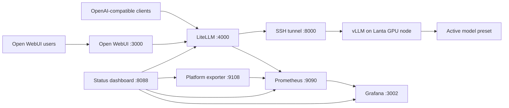

<!-- prettier-ignore -->
<div align="center">

# LantaLLM

*Run a private, OpenAI-compatible LLM platform on Lanta HPC with a stable API, browser chat, and observability.*


[Overview](#overview) • [Architecture](#architecture) • [Quick start](#quick-start) • [Service map](#service-map) • [API usage](#api-usage) • [Operations](#operations)

</div>

LantaLLM connects a GPU model running on Lanta HPC to a local Windows control plane. Users and API clients talk to one durable OpenAI-compatible model alias, `active-lanta-model`, while administrators can swap the underlying vLLM model without reconfiguring clients.

It combines vLLM, a Slurm-aware SSH tunnel, LiteLLM, Open WebUI, Prometheus, Grafana, and a compact FastAPI status dashboard into one reproducible hosting workflow.

> [!IMPORTANT]
> This repository is infrastructure for a specific Lanta account, Slurm setup, and Windows host workflow. Review remote paths, Slurm directives, secrets, ports, and model storage paths before adapting it elsewhere.

## Overview

```text
Lanta GPU node
  vLLM serves the selected Hugging Face model through an OpenAI-compatible API

Windows host
  Watchdog-managed SSH tunnel follows the active Slurm compute node

Local platform
  LiteLLM exposes one stable model alias, Open WebUI provides chat, and monitoring tracks health and usage
```

The main contract is stable even when the backend model changes:

| Layer | Value |
| --- | --- |
| Client model name | `active-lanta-model` |
| LiteLLM backend | `openai/<served-model-name>` |
| vLLM served model | Selected Lanta preset |

## Architecture



## Features

| Capability | What it provides |
| --- | --- |
| Model presets | Repeatable vLLM launch settings for supported coding models |
| Stable API alias | One OpenAI-compatible model name across backend swaps |
| Slurm-aware tunnel | Reconnects when the active vLLM job moves to another compute node |
| Browser chat | Open WebUI accounts, conversations, and settings |
| API governance | LiteLLM virtual keys, budgets, usage records, and PostgreSQL storage |
| Observability | Prometheus targets and a provisioned Grafana dashboard |
| Status dashboard | FastAPI health view for LiteLLM, vLLM, Open WebUI, exporter, and monitoring |
| Operations scripts | PowerShell checks for platform health and tunnel lifecycle |

## Prerequisites

### Windows host

- Windows PowerShell 5.1 or PowerShell 7
- Docker Desktop with Docker Compose
- OpenSSH with an SSH config alias named `lanta`
- Network access to the Lanta login node

### Lanta HPC

- Slurm account with GPU-node access
- Python environment containing vLLM
- Model files available under the configured Lanta project directory
- `lanta/scripts/` copied into the remote project scripts directory

Test the SSH alias first:

```powershell
ssh lanta "hostname; squeue -u <your-user>"
```

## Quick start

### 1. Configure local services

Copy the example environment files:

```powershell
Copy-Item litellm\.env.example litellm\.env
Copy-Item openwebui\.env.example openwebui\.env
Copy-Item observability\.env.example observability\.env
Copy-Item dashboard\.env.example dashboard\.env
```

Replace every placeholder secret before starting the platform. The LiteLLM master key used by Open WebUI must match the key configured for LiteLLM.

> [!CAUTION]
> Do not commit `.env` files, generated API keys, service data, model weights, or local runtime folders. Keep administrator keys separate from user-facing virtual keys.

### 2. Submit a model on Lanta

Start with the recommended daily preset:

```powershell
ssh lanta "cd /project/zz992000-zdevb/zz992005/ub127/SiliconCraft && bash scripts/submit-preset.sh qwen36-27b"
ssh lanta "squeue -u ub127"
```

If the model is not downloaded yet:

```powershell
ssh lanta "cd /project/zz992000-zdevb/zz992005/ub127/SiliconCraft && MODEL_REPO=Qwen/Qwen3.6-27B bash scripts/download-model.sh"
```

### 3. Start the tunnel

```powershell
powershell -ExecutionPolicy Bypass -File .\windows\tunnel\start-lanta-vllm-tunnel.ps1
powershell -ExecutionPolicy Bypass -File .\windows\tunnel\status-lanta-vllm-tunnel.ps1
```

Expected status:

```text
Watchdog: running
API:      online (HTTP 200)
```

### 4. Start the local platform

All Compose projects share the `lanta-llm-platform` Docker network:

```powershell
docker compose -f litellm/docker-compose.yml up -d
docker compose -f openwebui/docker-compose.yml up -d
docker compose -f observability/docker-compose.yml up -d
docker compose -f dashboard/docker-compose.yml up -d --build
```

### 5. Verify services

```powershell
$env:LITELLM_MASTER_KEY = "sk-your-master-key"
powershell -ExecutionPolicy Bypass -File .\scripts\check-platform.ps1
```

Open [Open WebUI](http://127.0.0.1:3000), create the first administrator account, and select `active-lanta-model`.

## Service map

| Service | URL | Audience |
| --- | --- | --- |
| Open WebUI | [127.0.0.1:3000](http://127.0.0.1:3000) | Chat users |
| LiteLLM API | [127.0.0.1:4000/v1](http://127.0.0.1:4000/v1) | API clients |
| vLLM tunnel | [127.0.0.1:8000/v1](http://127.0.0.1:8000/v1) | Local infrastructure |
| Status dashboard | [127.0.0.1:8088/status](http://127.0.0.1:8088/status) | Administrators |
| Platform exporter | [127.0.0.1:9108/metrics](http://127.0.0.1:9108/metrics) | Prometheus |
| Prometheus | [127.0.0.1:9090](http://127.0.0.1:9090) | Administrators |
| Grafana | [127.0.0.1:3002](http://127.0.0.1:3002) | Administrators |

## Supported model presets

| Preset | Model | Context | Reasoning parser |
| --- | --- | ---: | --- |
| `qwen36-27b` | Qwen/Qwen3.6-27B | 131,072 | `qwen3` |
| `qwen36-35b-a3b` | Qwen/Qwen3.6-35B-A3B | 131,072 | `qwen3` |
| `qwen3-coder-30b-a3b` | Qwen/Qwen3-Coder-30B-A3B-Instruct | 32,768 | None |
| `qwen25-coder-32b` | Qwen/Qwen2.5-Coder-32B-Instruct | 32,768 | None |
| `deepseek-coder-v2-lite` | deepseek-ai/DeepSeek-Coder-V2-Lite-Instruct | 32,768 | None |

Only one preset is served at a time by default. Submitting a new preset cancels the existing `vllm-model` job unless overridden.

## API usage

Use a LiteLLM virtual key instead of the administrator master key:

```powershell
$body = @{
  model = "active-lanta-model"
  messages = @(
    @{
      role = "user"
      content = "Write a four-cycle SystemVerilog repeat block."
    }
  )
  temperature = 0
  max_tokens = 512
} | ConvertTo-Json -Depth 10

Invoke-RestMethod `
  -Uri "http://127.0.0.1:4000/v1/chat/completions" `
  -Method Post `
  -Headers @{ Authorization = "Bearer sk-user-key" } `
  -ContentType "application/json" `
  -Body $body
```

Any OpenAI-compatible SDK can use:

```text
Base URL  http://<host>:4000/v1
Model     active-lanta-model
API key   <LiteLLM virtual key>
```

## Operations

### Tunnel lifecycle

```powershell
# Status
powershell -ExecutionPolicy Bypass -File .\windows\tunnel\status-lanta-vllm-tunnel.ps1

# Stop watchdog and SSH child
powershell -ExecutionPolicy Bypass -File .\windows\tunnel\stop-lanta-vllm-tunnel.ps1

# Start or recover
powershell -ExecutionPolicy Bypass -File .\windows\tunnel\start-lanta-vllm-tunnel.ps1
```

Tunnel logs are written under `windows/tunnel/.tunnel-runtime/`.

### Service lifecycle

```powershell
# Inspect
docker compose -f litellm/docker-compose.yml ps
docker compose -f openwebui/docker-compose.yml ps
docker compose -f observability/docker-compose.yml ps
docker compose -f dashboard/docker-compose.yml ps

# Stop without deleting persisted volumes
docker compose -f dashboard/docker-compose.yml down
docker compose -f observability/docker-compose.yml down
docker compose -f openwebui/docker-compose.yml down
docker compose -f litellm/docker-compose.yml down
```

> [!WARNING]
> Do not add `--volumes` unless you intentionally want to delete persisted Open WebUI accounts, LiteLLM records, and monitoring data.

### Observability

Grafana is the primary dashboard for request volume, token usage, latency, and errors. The status dashboard focuses on reachability and active-model health.

| Endpoint | Purpose |
| --- | --- |
| `GET /api/healthz` | Status dashboard process health |
| `GET /api/platform/status` | Component and active-model health |
| `GET /api/platform/usage?window=1h` | Experimental usage summary |

## Project structure

```text
.
├── dashboard/       # FastAPI status dashboard and Compose service
├── docs/            # Operations and key-management documentation
├── lanta/scripts/   # Slurm/vLLM submission and model download helpers
├── litellm/         # LiteLLM gateway, config, and PostgreSQL Compose stack
├── observability/   # Prometheus, Grafana, and platform exporter
├── openwebui/       # Open WebUI Compose stack
├── scripts/         # Local validation and health-check scripts
├── sharing/         # Compatibility sharing helpers
├── windows/tunnel/  # SSH tunnel watchdog scripts
└── HOW_TO_SWAP.md   # Model swap procedure
```

## Documentation

- [How to swap models](./HOW_TO_SWAP.md)
- [LiteLLM key management](./docs/KEY_MANAGEMENT.md)
- [Operations guide](./docs/OPERATIONS.md)
- [LiteLLM configuration notes](./litellm/README.md)
- [Observability notes](./observability/README.md)
- [Open WebUI notes](./openwebui/README.md)

## Troubleshooting

<details>
<summary><strong>The Slurm job is running, but localhost:8000 resets the connection</strong></summary>

The tunnel may still point to an earlier compute node. Restart the watchdog and confirm its log names the node shown by `squeue`.

```powershell
powershell -ExecutionPolicy Bypass -File .\windows\tunnel\stop-lanta-vllm-tunnel.ps1
powershell -ExecutionPolicy Bypass -File .\windows\tunnel\start-lanta-vllm-tunnel.ps1
powershell -ExecutionPolicy Bypass -File .\windows\tunnel\status-lanta-vllm-tunnel.ps1
```

</details>

<details>
<summary><strong>LiteLLM does not list active-lanta-model</strong></summary>

Check the vLLM tunnel first, then confirm `VLLM_MODEL_ID`, `VLLM_BASE_URL`, and `VLLM_API_KEY` in `litellm/.env`. Restart LiteLLM after changing its environment.

</details>

<details>
<summary><strong>Open WebUI cannot chat with the model</strong></summary>

Confirm Open WebUI points to LiteLLM, not raw vLLM. The Open WebUI API key should match the LiteLLM key configured for the UI service.

</details>

## Naming recommendation

The current name, `Lanta-LLM-Hosting`, is accurate but long. **LantaLLM** is shorter, keeps the Lanta identity, and still communicates the purpose of the project clearly.
